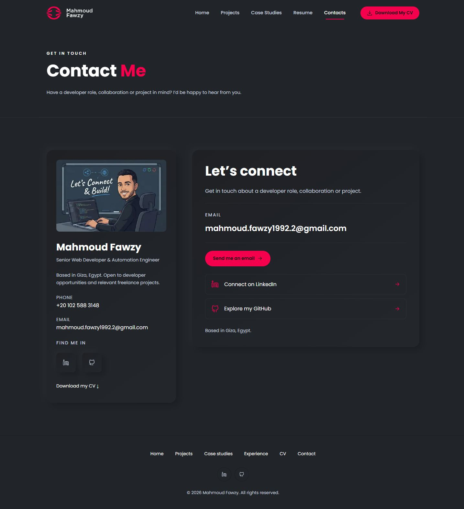

# Final pre-deployment cleanup

Completed locally September 30, 2026. Approved design, animation timings and hybrid navigation preserved. No push, deployment or production change.

## Completed changes

- Replaced the homepage and dedicated Contact forms with static contact cards: existing portrait/profile, location, phone/CV, clearly visible selectable email, Send me an email mailto action, LinkedIn and GitHub links. No unavailable-form notices or setup requirements remain.
- Removed EmailJS, React/React DOM, Astro React integration, their type packages, JSX-only accessibility lint dependency, form island/validation utility, form-specific styles/tests, public environment schema/example and dummy configuration verifier.
- Removed Privacy, footer references and sitemap entry. Audited the implementation: no analytics, tracking, embedded third-party content, browser storage or data submission remains. Old Privacy URLs return a real 404.
- Added OpenAI Codex prominently to AI-assisted engineering on Home and Experience, covering architecture, implementation, code generation, refactoring, troubleshooting, tests, review and agent workflows without invented credentials.
- Consolidated pink to exact #FF014F, including buttons/icons/accents. Small text uses existing neutrals; pink-filled buttons use dark #101114 text for approximately 4.83:1 contrast. Transparent tints use the same brand color. Updated the social card to remove the lighter pink.
- Reviewed hosting: no SPA rewrite; static directories, nested routes, custom 404, both legacy CV redirects and MIME declarations remain. Added guarded security headers and text compression. Omitted obsolete X-XSS-Protection. Replaceable HTML/images/CV revalidate; only content-hashed JS/CSS/fonts in _astro receive year-long immutable caching through the nested .htaccess.
- Updated current setup/hosting/audit/implementation/validation documents. Preserved the accepted visual-restoration screenshots as clearly marked historical evidence.

## Final checks

Production build, lint, Astro checks (34 files, zero diagnostics), three relevant regression tests, static verification, HTTP verification, dependency audit (zero advisories), whitespace checks and byte-verified ZIP extraction passed. All 31 projects, nine employment entries, three cases, current CV and Happylife's updated URL remain.

Browser checks confirmed responsive Contact layouts at 1440/390/320, selectable email, exact contact destinations, homepage section links and dedicated-page navigation. Original typing cycles and project hover/preview effects still work; keyboard/mobile drawer and focus remain usable. No new console warnings/errors were captured. The build has no external JavaScript chunks and no React islands; its unchanged shared enhancement module is 3.95 KB inline.

Details: [VALIDATION.md](VALIDATION.md), [current measurements](BUILD_MEASUREMENTS.json), [Hostinger instructions](HOSTINGER_DEPLOYMENT.md).

## Contact screenshots

[Desktop](final-cleanup/contact-1440.jpg), [mobile](final-cleanup/contact-390.jpg), [small mobile](final-cleanup/contact-320.jpg), [homepage contact](final-cleanup/home-contact-1440.jpg).

## Deployment artifact and manual review

Updated archive: output/portfolio-hostinger.zip — 126 files, 11,540,534 bytes, build files directly at root. Includes root and _astro/.htaccess. No source, environment configuration, dependencies, docs or obsolete Privacy route is included. Nothing was uploaded.

Review the contact presentation and exact-pink/dark-text buttons. Real devices, screen readers and an actual reduced-motion preference remain manual checks. After authorized publication, verify real Hostinger cache/security/compression headers, routing/MIME and sharing/search previews. If an older Astro archive was uploaded, remove its old Privacy directory; extracting a ZIP does not delete old hosting files.

Automatic approval review blocked deleting the obsolete tmp/emailjs-configured folder, citing “blocked by policy.” Its historical dummy test output remains ignored and excluded from all public/deployment files. All associated source, configuration and dependencies were removed.
