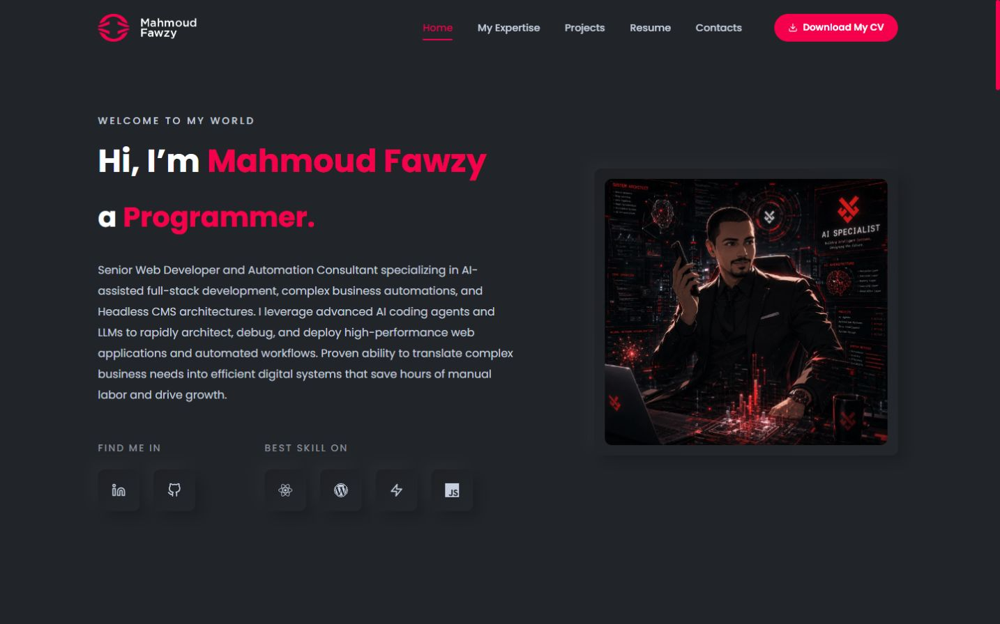
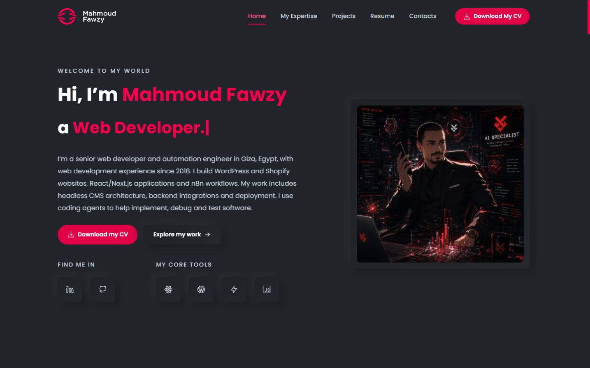

# Visual restoration, content and skills upgrade

> Historical acceptance record. The later [final cleanup](FINAL_CLEANUP.md) removes the form, React/EmailJS and Privacy, adds Codex and consolidates exact brand pink. Form configuration, former route counts, colors, measurements and screenshots below describe the earlier accepted snapshot, not the current build. Current setup and hosting instructions are in README.md and HOSTINGER_DEPLOYMENT.md.

Completed locally September 30, 2026. The accepted Astro migration was continued, preserving existing implementations. No commit, push, deployment or production change was made.

## Short report

The portfolio again uses the original live site's pink, Poppins typography, balanced hero, portrait frame, raised dark cards, icon buttons and animation style. The overlapping portrait caption has been removed. Professional copy now emphasizes developer employment, concrete capabilities and documented work.

The homepage stays concise; the full Experience page groups the expanded backend, automation, infrastructure, operations and technical-quality skills. All 31 projects, nine employment entries, the current CV, UPC Realty, the new Happylife link and exactly three case studies remain. Astro still produces ordinary static files for Hostinger.

Automated checks and browser verification passed. Form delivery still needs the existing EmailJS account settings. Hostinger behavior and search visibility need verification after a separately authorized publication. Your visual review and real-device/accessibility checks remain useful before publishing.

## Reference and comparison method

The authoritative reference was the actual [live original portfolio](https://mahmoud-fawzy.com/), including its major sections and mobile drawer. Original React components and CSS were also read from Git at `d882363`. Matching captures cover **1440×900, 1280×900, 390×844 and 320×740**, both initial view and Expertise, Projects, Experience and Contact. The original Experience tab was opened when comparing its employment presentation.

The 40 main comparison images are linked below. These are browser screenshots of rendered pages, not design mockups. Additional captures cover the eight inner routes at three widths, the mobile drawer, skills, project hover, a case-study anchor and the 404. Measured geometry is recorded in [measurements.json](visual-restoration/measurements.json); inner-route bounds are in [route-checks.json](visual-restoration/route-checks.json).

| Acceptance criterion | Restoration and evidence |
| --- | --- |
| 1. Color fidelity | Original background `#212428`, large/decorative accent `#FF014F`, muted text `#c4cfde` and original gradient/shadows restored. Measured large accent is identical on live/local. Accessible small-text and button exceptions are explained below. |
| 2. Typography | Local Poppins; desktop hero name 46px bold and role 40px bold; body 16px, hero line-height 30px; mobile name 36px. Original uppercase tracked greetings/section labels and centered section headings restored. |
| 3. Hero composition | Original 1200px container, 24px inner spacing, 1.2fr/0.8fr columns and 60px gap. Original greeting and white/pink name returned; CV and work actions retained. Desktop inner-grid height differs by only 2px. |
| 4. Portrait | Same artwork, frame padding, shadow and placement. Desktop frame width is exactly 436.8125px on both versions; 390px frame is 336px, 320px frame 266px. Optimized-image rounding changes desktop height by approximately 0.11px. Overlay caption removed entirely. |
| 5. Navigation | Original logo size, pink underline, five homepage section links, header background after scrolling, full-height mobile drawer, overlay and sliding transition. New pages use links to the dedicated routes. |
| 6. Icons | LinkedIn/GitHub plus React, WordPress, n8n and JavaScript use static SVG icon buttons, original raised treatment, accessible names and usable links. |
| 7. Skills/cards | Original rounded dark gradients, shadows, icon spacing and lift reused for six expertise cards and grouped skills. No arbitrary percentages or hidden employment tabs. |
| 8. Projects | Original rounded previews, image treatment, shadows, overlay and card typography. All 31 are in initial HTML; Home progressively shows nine, then six per Load More action. Work shows the full archive. |
| 9. Hover | Cards lift 10px with the original easing; icon buttons lift 5px and turn pink. Hover/focus previews scroll toward the image bottom. Browser measurements confirmed the lift and image position. |
| 10. Typing | Web Developer, Full-Stack Developer and Automation Engineer cycle with typing/deletion and blinking cursor. Browser samples recorded all three complete roles without changing hero height. Full role wording remains available to assistive technology. |
| 11. Reveals | Hero left/right entrance and section/card reveals restored through CSS and Intersection Observer. The initial content stays readable if JavaScript or animation fails. |
| 12. Timing | Card lift: .4s, cubic-bezier(.4,0,.2,1); image preview: 5s ease-in-out; reveal: .5s ease-out with .1/.2s staggering; hero: .7s ease-out, portrait delay .2s; drawer: .4s ease; cursor: 1.1s. |
| 13. Mobile | Portrait proportions and original stacking retained; grids wrap, drawer locks scrolling and traps keyboard focus, Escape returns focus. Local pages fit 390/320px without the horizontal overflow measured on the original mobile homepage. |
| 14. New pages | Work, Experience, Contact, Privacy and the case-study pages reuse the restored type, colors, shadows, image frames, cards, buttons and motion. All eight inner routes were inspected at 1440, 390 and 320px. |

### Desktop hero comparison

| Original live | Restored Astro |
| --- | --- |
|  |  |

### All matching homepage captures

Each cell links the original live capture and the corresponding local capture.

| Viewport | Hero | Expertise | Projects | Experience | Contact |
| --- | --- | --- | --- | --- | --- |
| 1440×900 | [Live](visual-restoration/live-1440-home.jpg) / [Local](visual-restoration/local-1440-home.jpg) | [Live](visual-restoration/live-1440-expertise.jpg) / [Local](visual-restoration/local-1440-expertise.jpg) | [Live](visual-restoration/live-1440-projects.jpg) / [Local](visual-restoration/local-1440-projects.jpg) | [Live](visual-restoration/live-1440-home-section-experience.jpg) / [Local](visual-restoration/local-1440-home-section-experience.jpg) | [Live](visual-restoration/live-1440-home-section-contact.jpg) / [Local](visual-restoration/local-1440-home-section-contact.jpg) |
| 1280×900 | [Live](visual-restoration/live-1280-home.jpg) / [Local](visual-restoration/local-1280-home.jpg) | [Live](visual-restoration/live-1280-expertise.jpg) / [Local](visual-restoration/local-1280-expertise.jpg) | [Live](visual-restoration/live-1280-projects.jpg) / [Local](visual-restoration/local-1280-projects.jpg) | [Live](visual-restoration/live-1280-home-section-experience.jpg) / [Local](visual-restoration/local-1280-home-section-experience.jpg) | [Live](visual-restoration/live-1280-home-section-contact.jpg) / [Local](visual-restoration/local-1280-home-section-contact.jpg) |
| 390×844 | [Live](visual-restoration/live-390-home.jpg) / [Local](visual-restoration/local-390-home.jpg) | [Live](visual-restoration/live-390-expertise.jpg) / [Local](visual-restoration/local-390-expertise.jpg) | [Live](visual-restoration/live-390-projects.jpg) / [Local](visual-restoration/local-390-projects.jpg) | [Live](visual-restoration/live-390-home-section-experience.jpg) / [Local](visual-restoration/local-390-home-section-experience.jpg) | [Live](visual-restoration/live-390-home-section-contact.jpg) / [Local](visual-restoration/local-390-home-section-contact.jpg) |
| 320×740 | [Live](visual-restoration/live-320-home.jpg) / [Local](visual-restoration/local-320-home.jpg) | [Live](visual-restoration/live-320-expertise.jpg) / [Local](visual-restoration/local-320-expertise.jpg) | [Live](visual-restoration/live-320-projects.jpg) / [Local](visual-restoration/local-320-projects.jpg) | [Live](visual-restoration/live-320-home-section-experience.jpg) / [Local](visual-restoration/local-320-home-section-experience.jpg) | [Live](visual-restoration/live-320-home-section-contact.jpg) / [Local](visual-restoration/local-320-home-section-contact.jpg) |

Additional evidence: [original drawer](visual-restoration/live-390-menu.jpg), [restored drawer](visual-restoration/local-390-menu.jpg), [project hover](visual-restoration/local-1440-project-hover.jpg), [desktop skills](visual-restoration/local-1440-skills.jpg), [mobile skills](visual-restoration/local-390-skills.jpg), [infrastructure and operations](visual-restoration/local-1440-infrastructure.jpg), [case anchor](visual-restoration/local-320-upc-decisions.jpg), [small-mobile 404](visual-restoration/local-320-404.jpg).

| New page | 1440px | 390px | 320px |
| --- | --- | --- | --- |
| Work | [View](visual-restoration/local-1440-work.jpg) | [View](visual-restoration/local-390-work.jpg) | [View](visual-restoration/local-320-work.jpg) |
| Case-study index | [View](visual-restoration/local-1440-case-studies.jpg) | [View](visual-restoration/local-390-case-studies.jpg) | [View](visual-restoration/local-320-case-studies.jpg) |
| Happylife | [View](visual-restoration/local-1440-case-studies-happylife-tourism.jpg) | [View](visual-restoration/local-390-case-studies-happylife-tourism.jpg) | [View](visual-restoration/local-320-case-studies-happylife-tourism.jpg) |
| UPC Realty | [View](visual-restoration/local-1440-case-studies-upc-realty.jpg) | [View](visual-restoration/local-390-case-studies-upc-realty.jpg) | [View](visual-restoration/local-320-case-studies-upc-realty.jpg) |
| Automation | [View](visual-restoration/local-1440-case-studies-n8n-acquisition-workflow.jpg) | [View](visual-restoration/local-390-case-studies-n8n-acquisition-workflow.jpg) | [View](visual-restoration/local-320-case-studies-n8n-acquisition-workflow.jpg) |
| Experience | [View](visual-restoration/local-1440-experience.jpg) | [View](visual-restoration/local-390-experience.jpg) | [View](visual-restoration/local-320-experience.jpg) |
| Contact | [View](visual-restoration/local-1440-contact.jpg) | [View](visual-restoration/local-390-contact.jpg) | [View](visual-restoration/local-320-contact.jpg) |
| Privacy | [View](visual-restoration/local-1440-privacy.jpg) | [View](visual-restoration/local-390-privacy.jpg) | [View](visual-restoration/local-320-privacy.jpg) |

## Skills and copy

The user's September 30 confirmation supplies the infrastructure/backend/automation evidence; the existing CV supplies the employment and previously listed tools. AI-assisted implementation and troubleshooting are acknowledged without implying that assistance replaces review or verification.

The full skills area contains nine groups:

1. Frontend and web applications: React, Next.js, JavaScript, TypeScript, HTML/CSS, Tailwind and Sass.
2. CMS and commerce: WordPress, headless WordPress, WooCommerce and Shopify.
3. Backend and integrations: Node.js, Express, REST, Prisma, PostgreSQL, MongoDB, authentication and webhooks.
4. Automation and data pipelines: n8n, Apify, Google Sheets, processing, retries and idempotency, plus CV-supported integration tools.
5. AI-assisted engineering: coding agents, LLM integration, debugging, code review and browser testing.
6. Deployment and infrastructure: VPS, Ubuntu/Linux, SSH/users/permissions, Docker/Compose, Caddy, HTTPS, DNS, environments and conservatively described GitHub Actions workflows.
7. Databases, operations and email: persistent volumes, migrations, backups, systemd, logs, container health checks, basic monitoring, business email configuration and transactional integrations.
8. Payments and technical quality: WooCommerce gateways, Paymob, technical SEO/GEO, accessibility, performance, security auditing and production troubleshooting.
9. Delivery and collaboration: version control, issue tracking, reviews and testing.

Home summarizes this in four compact groups. No new certifications, per-technology experience years, advanced mail-server administration or universal production responsibility are claimed.

Copy was reviewed across Home, Work, Experience, the case index, all three case pages, Contact, Privacy, 404, navigation, footer, controls, captions, alt text, accessible labels and metadata. Internal explanations such as “portfolio assets” were removed. Descriptions are concrete and recruiter focused; case limitations sit with the evidence. No fabricated outcomes or testimonials were added. Wayup/LMD remain gallery entries, not case studies.

## SEO/GEO and static hosting

The accepted SEO foundation remains: substantive initial HTML, nine indexable URLs, unique metadata, canonical/OG/Twitter, local social image, Person/WebSite/Article JSON-LD, sitemap, robots and real HTTP 404. Natural wording and visible skills improve relevance for WordPress, React/Next.js, automation, backend integration and deployment work. Person `knowsAbout` reflects supported capabilities. No search/AI ranking outcome is claimed.

The final ZIP is `output/portfolio-hostinger.zip`: **129 files, 11,599,056 bytes**, with build files and `.htaccess` at the archive root. Extraction verification compares every file against the build. It contains no enclosing `dist` directory, source, documentation, dependencies or environment files. Production requires no Node runtime.

## Intentional differences

- Original `#FF014F` stays on large headings, icons and decorative accents. Small pink text uses `#FF5B8D` (approximately 5.29:1 on the dark background); white-text accent buttons use `#EC0049` (approximately 4.51:1). The original white-on-pink combination was approximately 3.91:1. These are individual color checks, not a full WCAG certification.
- The recruiter-focused bio, CV/work actions and three case studies add meaningful content. Mobile spacing accommodates those actions; the role drops to 20px at 320px so the longest role fits (24px at 390px).
- Skills use readable cards/chips rather than unverifiable percentages. Employment remains visible rather than hidden behind a tab. Card interactions retain the original visual character.
- The drawer adds a visible close control, background inertness and keyboard containment. Footer social targets are at least 44px. Keyboard focus remains visible, and essential HTML never starts fully transparent.
- New pages have their own layouts within the original design system. Screenshots are viewport captures, not a claim of pixel-perfect equality throughout different content.

## Checks and limits

Production build, ESLint, Astro checks (38 files, zero diagnostics), five contact tests, static HTML/link/hash/metadata checks, nine-route HTTP checks, dummy EmailJS configuration checks, dependency audit (zero advisories), whitespace checks and verified ZIP extraction all passed. [VALIDATION.md](VALIDATION.md) records details.

After the final interruption, source and screenshot files were intact. Local servers had stopped and were restarted. Static and HTTP verification passed again; every one of the ZIP's 129 files still matched `dist/`; report links and all 24 saved inner-route checks passed. Fresh browser checks confirmed both Contact runtimes hydrate, no new warnings/errors, all 31 homepage cards with nine initially visible, six hero icons and the removed portrait caption. Documentation was finished without changing the accepted implementation.

Browser checks covered matching live/local sections, all eight inner routes at three widths, typing cycles, actual card/icon hover, image preview scrolling, filters, Load More, keyboard focus, skip link, drawer open/close/resize, case anchors, form validation/fallback and an actual CV download matching the source bytes. No local overflow, broken loaded images or error overlay was observed in the final route checks.

A stale development optimizer URL for EmailJS caused hydration failures during final inspection. Restarting `npm run dev` refreshed the cache. Fresh checks then confirmed enabled/hydrated forms on Home and Contact and no new warnings/errors; fresh production Contact also passed. Historical console errors are not represented as a clean run. Restart the dev server if optimized-dependency URLs become stale after tooling/build changes.

Measured final assets: external JS **145,778 bytes / 47,841 gzip**, inline enhancement module **3,947 bytes**, CSS **27,215 bytes / 6,319 gzip**, four font files **31,448 bytes**, optimized hero **59,294 bytes**. The restored animations/icons did not add external JavaScript chunks. These are local file measurements, not Lighthouse or field performance scores.

Manual review remains: your visual preference, real-device and screen-reader behavior, actual reduced-motion OS/browser preference, configured EmailJS delivery, and real Hostinger routing/sharing after authorized upload. Search Console, field performance and AI/search discovery require a published baseline. No live form, payment, campaign or workflow was executed.
